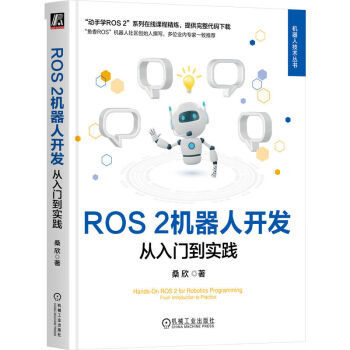

# ROS1 Noetic 机器人开发示例



本仓库是整理后的 **ROS1(catkin)** 示例代码集合，面向 ROS1 Noetic。代码按章节拆分成多个独立 catkin 工作空间，覆盖基础节点、话题、服务、TF、机器人描述、导航仿真、插件、真机/传感器接入和进阶通信模式。

## 工作空间说明

本仓库不是一个单一的 catkin 工作空间。请按章节分别构建，例如：

```bash
source /opt/ros/noetic/setup.bash
./bootstrap_catkin_workspaces.sh

cd chapt3/topic_ws
catkin_make
source devel/setup.bash
```

不同章节中存在同名包，例如 `fishbot_description`、`fishbot_navigation`、`autopatrol_robot`。不要把所有包合并到同一个 `src/` 下构建。

## 示例索引

| 章节 | 工作空间/目录 | 内容 |
| --- | --- | --- |
| chapt1 | `chapt1` | CMake、C++、Python 入门示例 |
| chapt2 | `chapt2/chapt2_ws` | C++/Python 节点、线程、函数、lambda 等基础示例 |
| chapt3 | `chapt3/topic_ws` | 话题发布订阅、turtlesim 控制、参数驱动 topic 示例 |
| chapt3 | `chapt3/topic_practice_ws` | 自定义消息、系统状态发布和显示 |
| chapt4 | `chapt4/chapt4_ws` | 自定义服务、Python/C++ 服务调用 |
| chapt5 | `chapt5/chapt5_ws` | 静态 TF、动态 TF、TF 监听 |
| chapt6 | `chapt6/chapt6_ws` | fishbot 机器人描述 |
| chapt7 | `chapt7/chapt7_ws` | Gazebo、AMCL、move_base、自动巡检 |
| chapt8 | `chapt8/chapt8_ws` | 自定义全局/局部规划器、pluginlib |
| chapt9 | `chapt9/fishbot_ws` | 真机 bringup、YDLidar、串口桥接、无硬件 odom mock |
| chapt10 | `chapt10/chapt10_ws` | executor、队列和 latch、message_filters 等进阶示例 |

## 新增可运行示例

基础通信：参数驱动 topic 发布。

```bash
cd chapt3/topic_ws
catkin_make
source devel/setup.bash
roslaunch demo_python_topic param_status.launch
```

默认发布 `/demo/param_status`，可通过 `robot_name`、`message`、`rate`、`topic` 调整输出。

导航仿真：参数化导航目标点。

```bash
cd chapt7/chapt7_ws
catkin_make
source devel/setup.bash
roslaunch fishbot_application nav_to_pose.launch x:=1.0 y:=0.0 yaw:=0.0
```

该示例会等待 `move_base` action server；未启动导航时会在 `wait_timeout` 到达后退出，避免一直阻塞。

无硬件硬件控制：mock 底盘里程计。

```bash
cd chapt9/fishbot_ws
catkin_make
source devel/setup.bash
roslaunch fishbot_bringup mock_hardware.launch
```

`mock_odom_publisher` 订阅 `/cmd_vel`，发布 `/odom`，再由现有 `odom2tf` 转成 TF。这个示例不依赖真实底盘、串口或雷达。

## 常用依赖

```bash
sudo apt update
sudo apt install -y \
  ros-noetic-robot-state-publisher \
  ros-noetic-joint-state-publisher \
  ros-noetic-gazebo-ros-pkgs \
  ros-noetic-xacro \
  ros-noetic-map-server \
  ros-noetic-amcl \
  ros-noetic-move-base
```

## 作者

- [小鱼](https://github.com/fishros)
